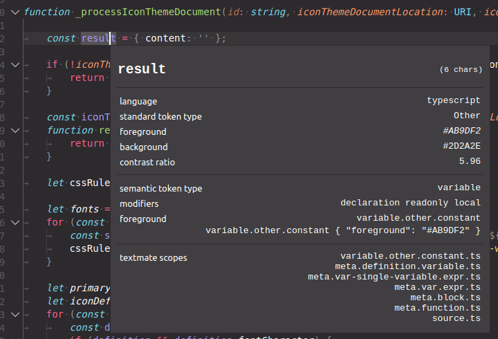

A [TypeScript plugin](https://github.com/Microsoft/TypeScript/wiki/Writing-a-Language-Service-Plugin) that replaces `getEncodedSemanticClassifications` and `getEncodedSyntacticClassifications` to provide more classifications to be used by the new [Semantic Highlighting APIs](https://github.com/microsoft/vscode/wiki/Semantic-Highlighting-Overview) in VS Code.

The purpose of this plugin is to test and enable the new VS Code semantic highlight capabilities. 

Once proven, the extended classifications will (hopefully) be adapted by the TypeScript language server and the plugin is no longer needed any more.

### New Classifications

The plugin uses new token classifications, consisting of a `TokenType` and with any number of `TokenModifier`s.

```
export const enum TokenType {
	class, enum, interface, namespace, typeParameter, type, parameter, variable, enumMember, property, function, member
}

export const enum TokenModifier {
	declaration, static, async, readonly, local
}
```

### Classification Encoding

The new classifications are retured in place of old the classifications. They are encoded as follows:
```
TSClassification = ((TokenType + 1) << 8) + TokenModifierSet;

```

All new classifications have a value >= 0x100 to not overlap with the old classifications. Old classifications are no longer emmitted once the plugin is active.

### Implemented Features

Examples for each feature can be seen in the [test cases](https://github.com/aeschli/typescript-vscode-sh-plugin/blob/master/src/test/semanticTokens.test.ts).


- all token types listed above
  - classification for all declarations and references
  - modifier `declaration` when on the identifier of the declaration node

- variables, properties and parameters
  - modifier `readonly` when defined as `const` or `readonly`
  - modifier `local` when not declared top-level
- object literal keys are currently also classified as properties (to be discussed)
- functions and members
  - modifier `async` when defined as `async`
  - modifier `static` when defined as `static`
- callable variables & properties
  - variables and properties that are function types are classified as function resp member
  - feature request: [#89337](https://github.com/microsoft/vscode/issues/89337).
  - if the type is callable but also has properties. E.g. `Number`, `String` or `Object` [#89221](https://github.com/microsoft/vscode/issues/89221), is stays a variable, unless used in a callExpression
  - still known bugs, e.g. for union types 
- types, namespace
  - use the node location to find out when name resolves to multiple symbols (namespace, type or variable)
  - the constructor function in `new` expressions is always classified as type 
- jsx 
  - avoid semantic highlighting for JSX element names (for now): [#88911](https://github.com/microsoft/vscode/issues/88911) [#89224](https://github.com/microsoft/vscode/issues/89224).

### Planned additions
- modifier `library` for symbols defined in one of the standard runtime libraries
- add `typeAlias` pas a new token type


### Try it out

#### In VS Code
- make sure semantic highlighting is enabled (on by default in insiders and since 1.43 in stable)
   `"editor.semanticHighlighting.enabled": true`
- open a TypeScript or JavaScript file in VSCode and wait for the language server to get active
- use the `Developer: Inspect Editor Tokens and Scopes` command to inspect the semantic information at a given cursor location.



#### Run the Tests

- `yarn && yarn test` in the folder of the cloned repo.